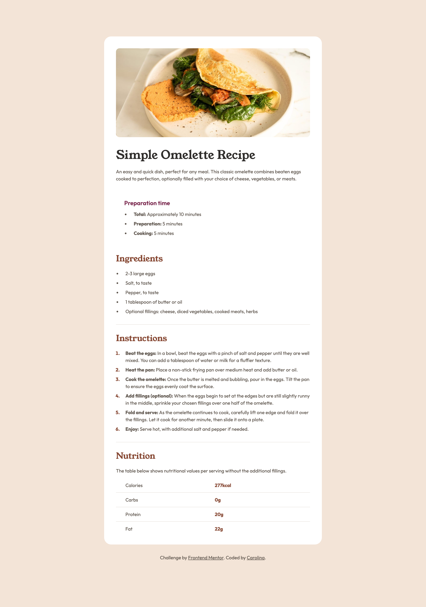
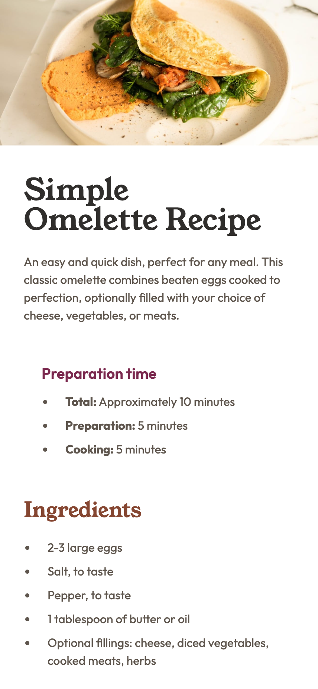

# Frontend Mentor - Recipe page solution

This is a solution to the [Recipe page challenge on Frontend Mentor](https://www.frontendmentor.io/challenges/recipe-page-KiTsR8QQKm). Frontend Mentor challenges help you improve your coding skills by building realistic projects.

## Table of contents

- [Overview](#overview)
  - [Screenshot](#screenshot)
  - [Links](#links)
- [My process](#my-process)
  - [Built with](#built-with)
- [Author](#author)

## Overview

### Screenshot

**Desktop**:

**Mobile:**

### Links

- Solution URL: [Frontend Mentor](https://www.frontendmentor.io/solutions/responsive-recipe-page-with-html-and-scss-euOz8Sb_Qe)
- Live Site URL: [Live Site](https://carolsemeao.github.io/recipe-page-main/)

## My process

### Built with

- HTML5
- SCSS / SASS

## Author

- Github - [@carolsemeao](https://github.com/carolsemeao)
- Frontend Mentor - [@carolsemeao](https://www.frontendmentor.io/profile/carolsemeao)
